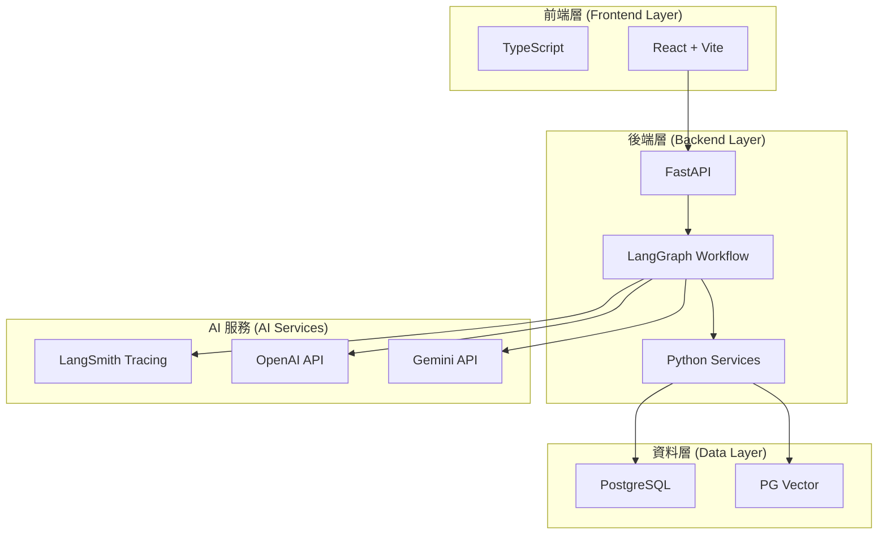
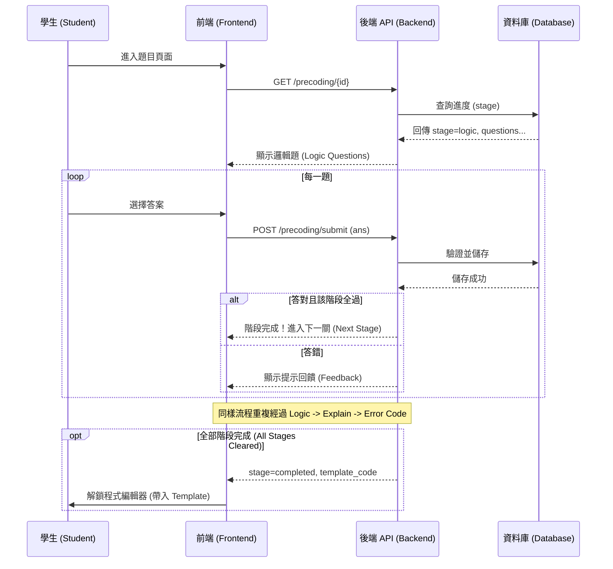
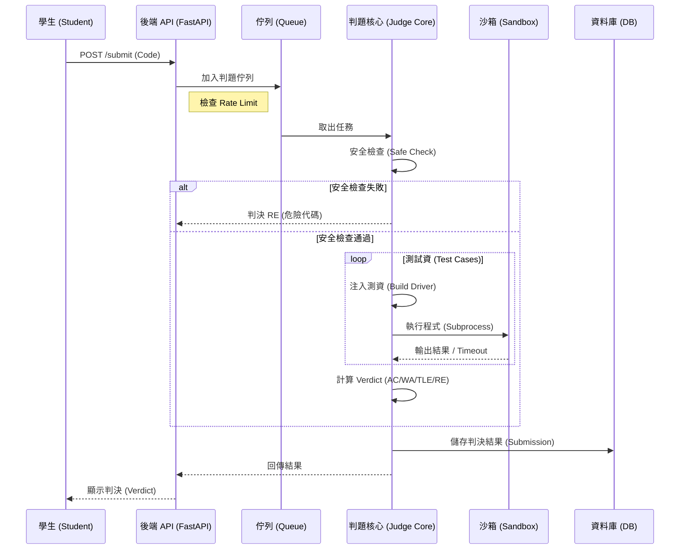
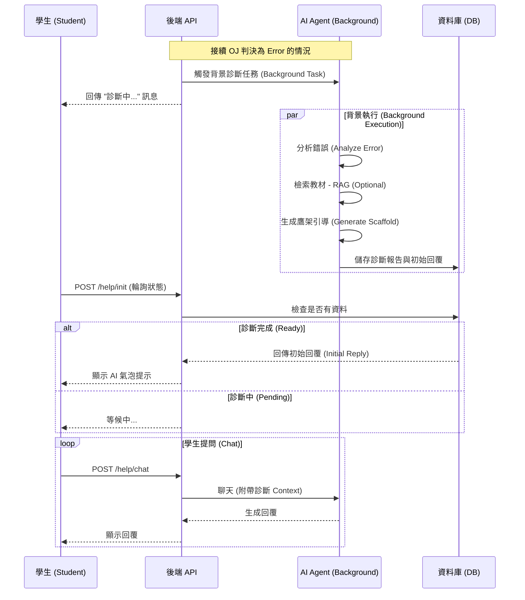

# CookAI 除錯教練系統開發者手冊

這份手冊是為了幫助開發者快速理解並接手 **CookAI 除錯教練 (Debugging Coach)** 系統。本系統結合了 **Online Judge (OJ)**、**RAG (檢索增強生成)** 與 **LangGraph Agent**，旨在為學生提供即時的程式除錯引導與觀念鞏固。

---

## 0. 一頁總覽 (Overview)

### 0.1 系統目的
打造一個「懂教學的 AI 助教」，不只是給出正確程式碼，而是透過 **鷹架理論 (Scaffolding)** 與 **近側發展區 (ZPD)** 策略，逐步引導學生找出錯誤，並針對薄弱觀念生成客製化練習題。

### 0.2 架構圖 (High-Level Architecture)



### 0.3 服務清單與 Owner

| 服務模組 | 主要職責 | 關鍵檔案 | Owner |
| :--- | :--- | :--- | :--- |
| **API Layer** | 處理前端請求、路由分發、背景任務管理 | `backend/app/routers/debugging.py` | Backend Team |
| **OJ System** | 程式碼判題、沙箱執行、安全檢查 | `judge_core.py`, `driver.py` | Platform Team |
| **Pre-Coding** | 寫程式前的邏輯引導 (Logic -> Explain -> Error) | `pre_coding.py` | Backend Team |
| **Agent Graph** | 錯誤診斷、RAG 檢索、鷹架引導、練習題生成 | `backend/app/agents/debugging/graph.py` | AI Team |
| **Vector DB** | 儲存課程教材 Chunk 與 Embedding | `backend/app/agents/debugging/graph.py` (SQLAlchemy) | AI Team |

### 0.4 風險清單 Top 5

1.  **OpenAI 成本暴衝**：Agent 流程複雜，若無限迴圈或 Token 消耗過大會導致成本失控。
2.  **OJ 沙箱逃逸**：雖然有 `safe_check`，但惡意程式碼仍可能影響系統穩定性。
3.  **DB 連線耗盡**：若大量並發請求同時寫入日誌與練習題，Postgres 連線數可能不足。
4.  **RAG 檢索品質**：若教材切割 (Chunking) 不佳，檢索出的 Context 可能誤導 AI。
5.  **模型幻覺 (Hallucination)**：AI 可能給出錯誤的程式觀念或不存在的語法建議。

---

## 1. 快速上手 (Quick Start)

### 1.1 環境準備
*   **Git**: Clone repository.
*   **Secrets**: 複製 `.env.example` 到 `.env`，填入 `OPENAI_API_KEY` 與 `DATABASE_URL`。
*   **Docker**: 確保本地有 Docker Desktop。

### 1.2 本機啟動 (最短步驟)

```bash
# 1. 啟動資料庫
docker-compose up -d db

# 2. 建立 Python 虛擬環境
python -m venv venv
source venv/bin/activate  # Windows: venv\Scripts\activate

# 3. 安裝依賴
pip install -r requirements.txt

# 4. 執行 Database Migrations (若有的話)
# alembic upgrade head 

# 5. 啟動 Backend
uvicorn backend.main:app --reload
```

---

## 2. 核心流程 (Core Flows)

### 2.1 系統 API 列表

為了讓開發者更清楚每個 API 的用途，以下依功能列表：

| HTTP Method | Endpoint (Prefix: `/debugging`) | 功能描述 |
| :--- | :--- | :--- |
| **Pre-Coding** | | |
| `GET` | `/precoding/{problem_id}` | 獲取 Pre-Coding 狀態 (Logic/Explain/Error 階段與題目) |
| `POST` | `/precoding/submit` | 提交 Pre-Coding 答案，驗證並解鎖下一階段 |
| **OJ & Post-Coding** | | |
| `POST` | `/submit` | 提交程式碼判題 (OJ)，若 AC 則生成練習，若 Error 則觸發診斷 |
| `GET` | `/student_code/{student_id}/{problem_id}` | 獲取學生最新程式碼、判決結果與練習題狀態 |
| `GET` | `/problems/chapter/{chapter_id}` | 獲取特定章節的所有題目列表 |
| `GET` | `/problems/{problem_id}` | 獲取單一題目的詳細資訊 (標題、描述、測資) |
| `POST` | `/practice/submit` | 提交 AC 後生成的鞏固練習題答案 |
| **CodingHelp** | | |
| `POST` | `/help/init` | 查詢背景診斷任務狀態，獲取 AI 初始引導 |
| `POST` | `/help/chat` | 與 AI 助教進行對話 (附帶 Context) |
| `GET` | `/help/history/{student_id}/{problem_id}` | 獲取該次提交的完整 AI 對話歷史 |

---

### 2.2 流程圖解

#### A. Pre-Coding 流程 (寫程式前導)

Pre-Coding 設計為三階段闖關，確保學生先懂邏輯再寫程式。



#### B. OJ 判題流程 (Online Judge Flow)

當學生提交程式碼時，系統進行安全檢查與測試執行。



#### C. CodingHelp 流程 (AI 助教)

學生寫程式遇到困難時 (Error)，系統會自動觸發診斷與引導。



### 2.2 Agent Debugging 流程 (`graph.py`)

這是本系統的大腦，使用 `LangGraph` 實作狀態機：

1.  **analyze_code (Diagnostic Agent)**:
    *   輸入：錯誤程式碼、錯誤訊息。
    *   輸出：JSON 格式的錯誤診斷報告 (Error Type, Misconception)。
2.  **router (Router Node)**:
    *   判斷是否需要查教材 (Logic Error / Concept Error -> RAG; Syntax Error -> Skip)。
3.  **retrieve (RAG Node)**:
    *   若需要，將診斷出的觀念轉為 Embedding，從 `document_chunks` 表中檢索 Top 3 相關教材。
4.  **scaffold_help (Scaffolding Agent)**:
    *   結合「診斷報告」、「教材 Context」與「歷史錯誤次數 (ZPD Level)」。
    *   生成引導式對話 (不直接給答案)。
    *   結果存入 `dialogue_table`。

### 2.3 OJ 系統細節

*   **核心檔案**: `backend/app/agents/debugging/OJ/judge_core.py`
*   **流程**:
    *   `safe_check(code)`: 禁止 `import os`, `subprocess`, `exec`, `eval` 等危險關鍵字。
    *   `build_driver_code(...)`: 將使用者函數包裝，並插入測試資料作為 `if __name__ == "__main__":` 區塊。
    *   `run_in_sandbox(...)`: 執行 Python subprocess，設置 `timeout` 防止無窮迴圈。
### 2.3 資料庫結構 (Database Schema)

本系統主要使用兩個 Schema：`debugging` (核心業務) 與 `public` (共用資料/RAG)。

| Schema | Table Name (SQL) | 對應圖示名稱 | 功能描述 |
| :--- | :--- | :--- | :--- |
| `debugging` | `problem` | `problem` | 儲存題目基本資訊 (ID, 測資, 判題設定)。 |
| `debugging` | `debugging_code_submission` | `debugging_code_submission` | 學生提交的程式碼歷史、判題結果 (Verdict) 與 Output。 |
| `debugging` | `precoding_question` | `precoding_question` | Pre-Coding 階段的題庫 (Logic, Error Code, Explain Code 題目)。 |
| `debugging` | `precoding_student_answers` | `precoding_student_answers` | 記錄學生在 Pre-Coding 各階段的闖關進度與作答內容。 |
| `debugging` | `debugging_evidence_report` | `debugging_evidence_report` | AI 診斷報告 (Analysis)，儲存每次 Error Submission 的錯誤分析。 |
| `debugging` | `debugging_dialogue` | `debugging_dialogue` | 學生與 AI 助教 (CodingHelp) 的對話紀錄。 |
| `debugging` | `debugging_practice` | `debugging_practice` | 學生 AC 後生成的鞏固練習題與作答結果。 |
| `public` | `document_chunks` | `document_chunks` | RAG 用。儲存切分後的教材段落與向量 (Embedding)。 |
| `public` | `unique_contents` | `document_content` | RAG 用。儲存原始教材檔案資訊 (Hash, Size) 以避免重複處理。 |
| `public` | `users` | `user_info` | 儲存使用者帳號、Email 與基本資料。 |

---

## 3. 部署與發布 (Deployment)

*   **環境差異**:
    *   **Dev**: `RELOAD=True`, 使用本地 Docker DB。
    *   **Prod**: 只允許來自 Frontend Domain 的 CORS，使用 AWS RDS。
*   **發布**:
    *   目前採用 Docker Container 部署。
    *   更新流程: `git pull` -> `docker build` -> `docker-compose restart backend`。

---

## 4. 監控與告警 (Observability)

### 4.1 重要指標
*   **API Response Time**: 特別關注 `/submit` 接口，等待 OJ 超過 5 秒需告警。
*   **Background Task Queue**: 堆積數量過多代表 Agent 處理不及。
*   **OJ Verdict Stats**: 異常高的 RE (Runtime Error) 率可能代表沙箱配置有誤或系統層級錯誤。

### 4.2 查錯關鍵
*   **Trace**: 每個 Request 都應記錄 `student_id` 與 `problem_id`。
*   **Logs**: `logging.getLogger(__name__)` 用於追蹤 Agent 內部狀態 (e.g., `Retrieval error`, `Judge failed`)。

---

## 5. Runbook (故障排除)

### 5.1 API 逾時 (Timeout)
*   **現象**: 前端轉圈圈，後端 Log 顯示 Timeout。
*   **原因**: LLM 回應過慢 (OpenAI Latency) 或 OJ 執行無窮迴圈程式碼。
*   **處置**:
    1.  檢查 OpenAI Status Page。
    2.  檢查 DB CPU 是否飆高 (Vector Search 效能)。
    3.  若 OJ 卡住，重啟 backend container 釋放 subprocess 資源。

### 5.2 練習題生成失敗
*   **現象**: 學生 AC 但沒看到練習題。
*   **處置**:
    1.  檢查 `backend/app/routers/debugging.py` 中的 `Sync Practice Generation Failed` Log。
    2.  通常是 JSON Parse Error (LLM 沒按格式輸出)。
    3.  短期解法：手動觸發或忽略 (這不是 Critical Blocking Issue)。

### 5.3 Agent 引導品質差 (鬼打牆)
*   **現象**: AI 一直重複同一句話，或給出錯誤提示。
*   **處置**:
    1.  檢查 `backend/app/agents/debugging/graph.py` 中的 Prompt Template。
    2.  檢查 `previous_reports` 是否正確傳入 (Context Window 是否不足)。
    3.  調整 `zpd_level` 判斷邏輯。

---

## 6. 安全與合規

### 6.1 Secrets 管理
*   絕對禁止將 API Key Commit 進 Git。
*   所有 Key 必須透過 Environment Variables 注入。

### 6.2 Agent 權限
*   Agent **沒有** 寫入 DB 的權限 (除了 Log 自己的對話)。
*   Agent **無法** 執行 Shell Command。
*   OJ 執行環境與 Backend 執行環境需隔離 (目前使用 Subprocess，建議未來遷移至 Docker 內部執行)。

---

## 7. 附錄

### A. 常用指令
*   **Re-index Vector DB**: (需手動執行 Script) `python backend/debug_db.py` (假設此腳本包含相關測試)。
*   **Clear Log**: 清空 `debugging.evidence_reports` 表格以重置學生狀態。

### B. 專案檔案結構 (Project Structure)

僅列出與 Debugging System 相關的核心檔案：

```text
Cook.ai_debugging_fun/
├── backend/app/
│   ├── routers/
│   │   └── debugging.py           # API Controller (API 入口)
│   └── agents/debugging/
│       ├── OJ/                    # Online Judge 核心模組
│       │   ├── judge_core.py      # 判題主邏輯
│       │   └── sandbox_runner.py  # 沙箱執行器
│       ├── graph.py               # LangGraph Agent 流程定義 (核心大腦)
│       ├── pre_coding.py          # Pre-Coding 邏輯處理
│       ├── db.py                  # 資料庫 Table 定義與存取函式
│       └── oj_models.py           # OJ 相關的資料模型
│
└── frontend/src/
    ├── pages/student/debugging/
    │   ├── StudentPreCoding.tsx   # Pre-Coding 頁面 (邏輯/錯誤引導闖關)
    │   └── StudentCodingHelp.tsx  # CodingHelp 頁面 (寫程式 + AI 助教)
    └── components/student/debugging/
        └── Sidebar.tsx            # 側邊欄組件
```
